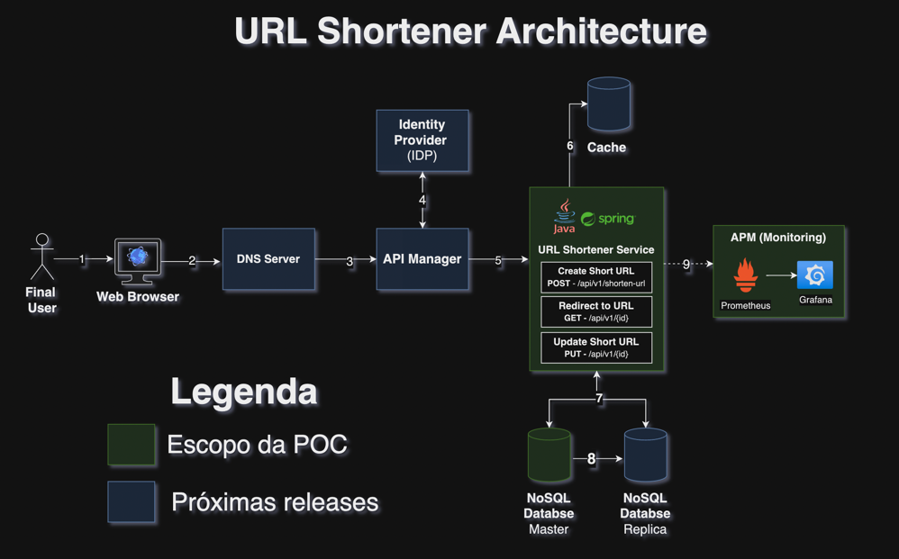
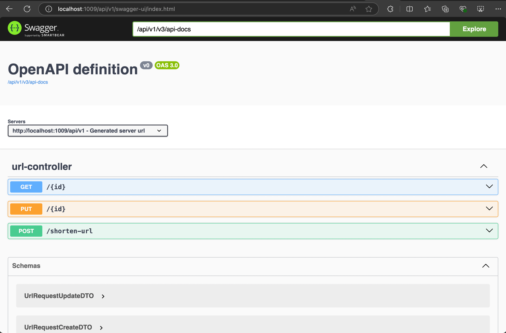
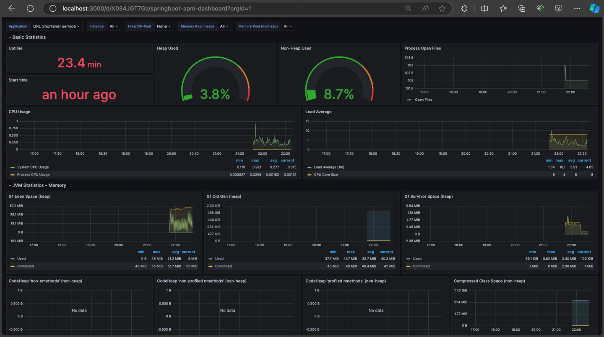

# POC - Aplicação para encurtamento de URLs utilizando Java e Spring Boot 

## 1. Contexto Funcional

**Encurtadores de URLs** são serviços que facilitam o compartilhamento de páginas e conteúdos na internet através de links
curtos e fáceis de se memorizar.
Essas ferramentas atuam como "proxies", redirecionando o usuário para uma página de destino a partir de um link encurtado.
Além de facilitar a navegação, essas ferramentas podem apoiar as empresas fornencendo estatísticas valiosas sobre o tráfego 
das suas páginas e campanhas nas redes sociais, como Twitter e Instagram.

Para construirmos uma solução de encurtamento de URLs com sucesso, é necessário escolhermos corretamente os componentes
arquiteturais visando **escalabilidade**, **alta disponibilidade** e **tolerância a falhas**. 

Por isso, desenvolvi uma **POC (Prova de Conceito)** envolvendo a criação de um serviço de encurtamento de URLs (URL Shortener) utilizando
**Java 17**, **Spring Boot 3**, **MongoDB**, **Prometheus** e **Grafana**. Essa stack é utilizada com sucesso em produção por grandes
empresas em casos de uso que exigem alta performance como **streaming de conteúdo**, **mobile banking**, **IoT**, entre outros.

## 2. Diagrama da solução

O seguinte diagrama ilustra em alto nível o design da solução que visa atender os requisítos discutidos à cima. 

Para facilitar o entendimento, enumerei a sequência de etapas envolvidas em uma requisição à uma página
a partir de sua URL encurtada (cadastrada previamente em nossa API).

1. Usuário digita em seu **navegador** a **URL encurtada** da página que deseja acessar;
2. (Externo) **Servidor de DNS** indica o **IP** do **API Manager** que atenderá a requisição do usuário;
3. (TODO) A chamada chega ao **API Manager**. Nessa camada, podemos realizar a autenticação, autorização da requisição, 
controlar limites de chamadas e apontar para o serviço adequado para atender determinada demanda, baseando-se, por 
exemplo no Path ou parâmetros da requisição.
4. (TODO) No caso de chamadas autenticadas, podemos implementar mecanismos de autenticação baseados em OAUTH2 utilizando
provedores de identidade como **Azure AD** ou **AWS Congito User Pool**;
5. (TODO) A requisição chega ao microsserviço desenvolvido em Java com Spring Boot;
6. (TODO) É realizado uma consulta no cache para buscar a URL original referente ao código da URL encurtada solicitada;
7. Caso o cache não possua o registro referente à URL solicitada na requisição, a base de dados principal será
consultada e o dado será replicado no cache para que novas consultas sejam feitas mais rapidamente;
8. (TODO) No cenário de uma aplicação que realiza intensamente consultas do tipo leitura, podemos provisionar instâncias
dedicadas a atender apenas a esse tipo de consulta (Read Replicas), assim gerando ainda mais eficiência de processamento.
Também é recomendável criarmos instâncias de backup para atender requisições caso a base principal falhe por quaisquer eventos
de falha ou desastre. Nesse caso, podemos garantir que essas bases estejam sincronizadas de forma assíncrona.
9. Nossa aplicação Spring envia diversas métricas em tempo real sobre requisições, consumo de memória e saúde do serviço
para o Actuator do Prometheus. Esse por sua vez, serve como fonte de dados para um dashboard de monitoramento no Grafana.

## 3. Recursos da API

A API foi desenvolvida visando atender requisições para **criação**, **atualização** e **redirecionamento** de URLS Encurtadas. Seus 
recursos seguem o padrão **REST** no formato **JSON**.

**POST /api/v1/shorten-url:** Cria uma URL encurtada a partir de uma URL Original

    Requisição
    {
        "fullUrl": "google.com"
    }
    
    Resposta: (HTTP 201)
    {
        "url": "http://localhost:1009/api/v1/f8513d9a",
        "isEnabled": true
    }

**GET /api/v1/{id}:** Redireciona a chamada para a **URL Original** a partir de uma **URL encurtada** representada por 
um código (id).

    Cabeçalho da Resposta: (HTTP 302)
        Location: https://google.com
        Content-Length: 0
        Date: Tue, 27 Aug 2024 00:47:12 GMT
        Keep-Alive: timeout=60
        Connection: keep-alive
       

**PUT /api/v1/{id}:** Atualiza a URL de destino e status (ativo/inativo) de uma URL encurtada representada por um código (id)

    Requisição:
    {
        "fullUrl":"https://mock4tech.com",
        "isEnabled": false
    }
    
    Resposta: (204) <No Content>

A definição da API pode ser encontrada através da seguinte URL em modo de execução local: http://localhost:1009/api/v1/swagger-ui/index.html

## 4. Execução local

O microsserviço foi desenvolvido utilizando **Java 17** e **Spring Boot 3.3.2**. Siga os seguintes passos para executá-lo em sua máquina:

1. Execute os containêres Docker referente ao banco de dados (MongoDB) e ferramentas
de monitoramento (Prometheus e Grafana) através dos seguintes comandos que devem ser executados na raíz do projeto:
   
    `cd docker`
    
    `docker compose up`

2. Realize o build do projeto através do comando:
    
    `mvn clean package`

3. Execute a aplicação através do .jar gerado na etapa anterior:

    `java -jar target/urlshortener-0.0.3.jar`

4. A aplicação iniciará na `porta 1009` de sua máquina. Verifique o status do **health check** através da URL: http://localhost:1009/api/v1/actuator/health

## 5. Testes Unitários

Para o desenvolvimento dos testes unitários foram utilizadas as dependências **Spring Boot Test**, **JUnit** e **Mockito**, sendo que foi atingo **90% de
cobertura** nas linhas de código.

## 6. Application Performance Monitoring (APM)

Para a coleta de métricas de **desempenho**, **consumo de recursos** e **requisições** foram utilizadas as dependências 
Spring Boot Actuator e Prometheus. Já para a visualização de dashboards foi utilizado Grafana. Segue print:

Url para acesso ao Grafana (disponível após o serviço ser inicializado na Etapa 4): http://localhost:3000

